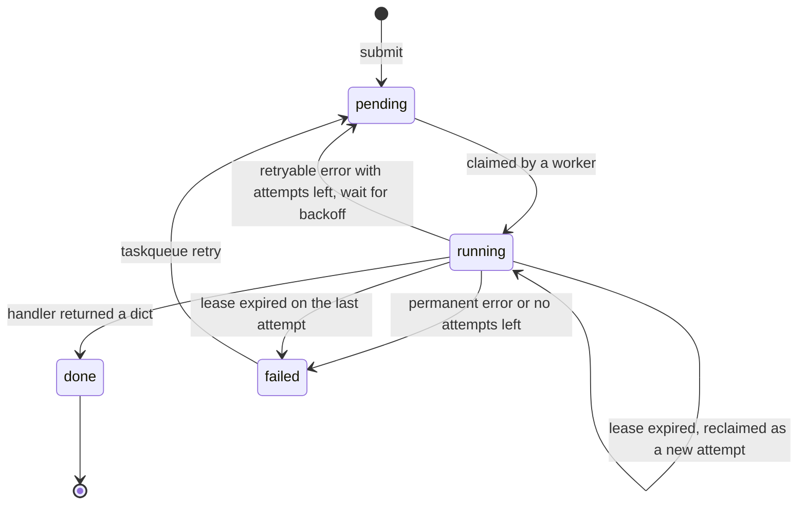

# TaskQueue

A persistent, single-machine background job queue, backed by SQLite and written with
only the Python standard library.

Producers submit jobs (a type plus a JSON payload) to a SQLite file. Separate worker
processes claim jobs atomically, run a handler, and store the result. Transient failures
are retried with exponential backoff. If a worker crashes, its job is reclaimed when its
lease expires. Delivery is **at-least-once**.

**Why.** Many small projects need "run this later, reliably, and tell me what happened"
without running Redis, RabbitMQ, or Celery. TaskQueue is one SQLite file plus as many
worker processes as you start. Jobs survive crashes and restarts, and every state
change is a transaction you can inspect with `taskqueue list` or plain `sqlite3`. The
reasoning behind each design choice is in [DESIGN.md](DESIGN.md).

## Quickstart

Requires Python 3.10 or later.

```bash
python -m venv .venv && source .venv/bin/activate
pip install -e ".[dev]"
pytest -q

taskqueue submit csv_summary --path samples/orders.csv
taskqueue worker --exit-when-idle
taskqueue show 1
```

`python -m taskqueue ...` works the same as `taskqueue ...`.

## Commands

| Command | What it does |
| --- | --- |
| `submit TYPE [--path P \| --payload JSON] [--max-attempts N] [--delay S]` | Validate and enqueue a job. `--path P` is shorthand for `--payload '{"path": "P"}'`. |
| `list [--status S] [--limit N]` | Table of jobs, newest first, with when each will next change state and a truncated last error. |
| `show ID` | One job as pretty-printed JSON. |
| `retry ID` | Requeue a failed job with a fresh attempt budget. |
| `stats` | Job counts per status. |
| `worker [--worker-id ID] [--lease-seconds 30] [--poll-interval 0.25] [--exit-when-idle] [--max-jobs N] [--retry-base 2] [--retry-max 60]` | Process jobs until stopped. |

Global options come before the command: `--db PATH` (default `$TASKQUEUE_DB`, or
`taskqueue.db` if that is unset) and `-v` for debug logs. Exit codes: `0` success; `1`
job not found, or a database or OS error; `2` invalid input; `130` worker aborted.

On the first Ctrl-C or SIGTERM, a worker finishes its current job and exits 0. A second
Ctrl-C aborts at once, and the abandoned job is reclaimed when its lease expires.

Built-in job types:

| Type | Payload | Result |
| --- | --- | --- |
| `csv_summary` | `{"path": str}`, resolved to an absolute path at submit time | `{"row_count", "columns", "missing_by_column"}` |
| `flaky` | `{"fail_times": int >= 0}`, fails with a transient error on attempts 1 to `fail_times` | `{"succeeded_on_attempt": n}` |
| `sleep` | `{"seconds": 0..300}` | `{"slept": seconds}` |

To add a job type, add a `HandlerSpec(run=..., validate=...)` to `HANDLERS` in
[taskqueue/handlers.py](taskqueue/handlers.py). `validate` normalizes the payload or
raises `ValueError`. `run(payload, ctx)` returns a JSON-serializable dict.

## Job lifecycle



Every claim adds 1 to `attempts`, including a claim that reclaims a job from a dead
worker. A job waiting to retry is `pending` with `available_at` in the future, so it
never blocks other jobs.

## Demo

This output was captured from the real CLI, with `export TASKQUEUE_DB=demo.db` in the
repo root. Worker ids are set explicitly to keep the output readable. By default a
worker's id is `HOSTNAME-PID`.

**A CSV summary succeeds.**

```console
$ taskqueue submit csv_summary --path samples/orders.csv
submitted job 1 (csv_summary)
$ taskqueue worker --exit-when-idle --worker-id worker-a
17:39:59 INFO worker worker-a started
17:39:59 INFO job 1 csv_summary attempt 1/1 took 0.9 ms: done
17:39:59 INFO worker worker-a stopped (queue drained) after 1 job(s)
$ taskqueue show 1
{
  "id": 1,
  "type": "csv_summary",
  "payload": {
    "path": "/Users/faeezali/job-queue/samples/orders.csv"
  },
  "status": "done",
  "attempts": 1,
  "max_attempts": 1,
  "available_at": 1790458799.838186,
  "lease_expires_at": null,
  "worker_id": "worker-a",
  "result": {
    "row_count": 3,
    "columns": [
      "item",
      "quantity",
      "price"
    ],
    "missing_by_column": {
      "item": 0,
      "quantity": 1,
      "price": 1
    }
  },
  "last_error": null,
  "created_at": 1790458799.838186,
  "started_at": 1790458799.8786292,
  "finished_at": 1790458799.879654
}
```

**A flaky job fails twice, backs off, then succeeds.** The backoff is 2 s and then 4 s,
each with ±20% jitter.

```console
$ taskqueue submit flaky --payload '{"fail_times": 2}' --max-attempts 3
submitted job 2 (flaky)
$ taskqueue worker --exit-when-idle --worker-id worker-a
17:40:00 INFO worker worker-a started
17:40:00 INFO job 2 flaky attempt 1/3 took 0.5 ms: retry in 2.3s (TransientDemoError: planned failure 1 of 2)
17:40:02 INFO job 2 flaky attempt 2/3 took 2.7 ms: retry in 3.3s (TransientDemoError: planned failure 2 of 2)
17:40:05 INFO job 2 flaky attempt 3/3 took 1.4 ms: done
17:40:05 INFO worker worker-a stopped (queue drained) after 3 job(s)
```

**A malformed CSV fails immediately.** Bad input is a permanent error, so the job is
not retried, even though two attempts are left.

```console
$ taskqueue submit csv_summary --path samples/malformed.csv --max-attempts 3
submitted job 3 (csv_summary)
$ taskqueue worker --exit-when-idle --worker-id worker-a
17:40:06 INFO worker worker-a started
17:40:06 INFO job 3 csv_summary attempt 1/3 took 0.8 ms: failed (ValueError: line 2: row has 4 fields but the header has 3)
17:40:06 INFO worker worker-a stopped (queue drained) after 1 job(s)
$ taskqueue list
ID  TYPE         STATUS  ATTEMPTS  WHEN  LAST_ERROR
3   csv_summary  failed  1/3       -     ValueError: line 2: row has 4 fields but the he...
2   flaky        done    3/3       -
1   csv_summary  done    1/1       -
```

**Crash recovery.** A 10 s job is claimed by a worker with a 5 s lease, and that worker
is killed with `kill -9`. A second worker waits for the lease to expire, then reclaims
the job as attempt 2.

```console
$ taskqueue submit sleep --payload '{"seconds": 10}' --max-attempts 2
submitted job 4 (sleep)
$ taskqueue worker --worker-id worker-a --lease-seconds 5 &
17:40:06 INFO worker worker-a started
$ kill -9 $!   # simulate a crash mid-job
$ taskqueue list --limit 1
ID  TYPE   STATUS   ATTEMPTS  WHEN             LAST_ERROR
4   sleep  running  1/2       lease 4.0s left
$ taskqueue worker --exit-when-idle --worker-id worker-b
17:40:07 INFO worker worker-b started
17:40:11 WARNING job 4: lease held by worker-a expired; reclaimed by worker-b as attempt 2/2
17:40:21 INFO job 4 sleep attempt 2/2 took 10004.9 ms: done
17:40:21 INFO worker worker-b stopped (queue drained) after 1 job(s)
$ taskqueue show 4 | grep -E '"(status|attempts|worker_id|result|slept)"'
  "status": "done",
  "attempts": 2,
  "worker_id": "worker-b",
  "result": {
    "slept": 10
$ taskqueue stats
pending  0
running  0
done     3
failed   1
total    4
```

## Guarantees and limits

- **At-least-once, not exactly-once.** A job can run more than once. For example, a
  worker might crash after its handler has done the work but before the result is
  committed, or a job might outlive its lease. Make handlers idempotent.
- **Fenced writes.** An outcome is recorded only if the worker still holds that exact
  attempt (matched on `id`, `status`, `worker_id`, and `attempts`). A worker that lost
  its lease has its late result discarded, and it logs a warning.
- **No heartbeat.** A lease is fixed when the job is claimed and is never extended. Set
  `--lease-seconds` longer than your slowest job, or a healthy job that runs past its
  lease will be started again by another worker. Recovering a crashed job also takes up
  to one lease.
- **Retries.** A retry happens only for errors that are not classified as permanent
  (`PermanentJobError`, `ValueError`, `TypeError`, `KeyError`, `FileNotFoundError`,
  `IsADirectoryError`, `NotADirectoryError`, and `PermissionError` are permanent), and
  only while `attempts < max_attempts`. The default is `max_attempts=1`, which means no
  retries.
- **Single machine.** All processes must share the database file on a local disk.
  SQLite's WAL mode does not work over network filesystems. This is not a distributed
  queue.
- **Trusted local files only.** `csv_summary` reads whatever path it is given, with the
  worker's permissions.
- **Not included:** priorities, scheduling beyond `--delay`, job dependencies, cleanup
  of old results (rows are kept forever), a web UI, and authentication.

## Benchmark

`scripts/bench.py` measures each combination of worker count and per-job work time. For
each one it creates a fresh temporary database, enqueues N `sleep` jobs, and starts W
`taskqueue worker --exit-when-idle` subprocesses. It times from starting the workers
until the last one exits, which includes about 90 ms of Python startup per process. It
then checks that every job ended `done` on attempt 1.

```console
$ python -m scripts.bench --jobs 500 --workers 1 2 4 --work-ms 0 10
workers  work_ms   jobs  seconds  jobs/sec  verified
      1        0    500     0.59     840.7  yes
      2        0    500     0.26    1920.1  yes
      4        0    500     0.49    1016.8  yes
      1       10    500     8.34      59.9  yes
      2       10    500     4.12     121.3  yes
      4       10    500     2.11     236.8  yes
```

Machine: Apple M4 (10 cores), macOS 27.0 (build 26A428), Python 3.14.0, SQLite 3.50.4.

**At 0 ms, more workers help only a little, and not reliably.** In three more runs at
0 ms, 1 worker handled 587 to 925 jobs/s, 2 workers 894 to 2124, 4 workers 1525 to 2123,
and 8 workers 854 to 949. In a longer 2,000-job run, 1, 2, and 4 workers handled 876,
1776, and 2185 jobs/s. A second worker roughly doubled throughput. Going from two
workers to four ranged from 47% slower (the table above) to 71% faster. Eight workers
were about as fast as one.

The limit is SQLite's single write lock. Each job needs two write transactions (claim,
then complete), and SQLite allows only one writer at a time for the whole file. More
processes can overlap only the work done outside the lock: opening connections, decoding
JSON, and logging. Beyond that, workers queue on the lock, and SQLite's busy handler
waits by sleeping and retrying.

**With real work per job, workers scale almost linearly** (59.9, 121.3, and 236.8 jobs/s
at 10 ms), because the lock is held for only a small part of each job. A single worker's
16.7 ms per job at 10 ms of work is mostly the sleep itself: on this machine
`time.sleep(0.01)` measured 12.1 ms on average.

## Layout

```
taskqueue/
  __init__.py      public API re-exports
  __main__.py      python -m taskqueue
  cli.py           argparse CLI (the only module that prints)
  db.py            connect, init_db (schema v1, WAL), transaction (BEGIN IMMEDIATE)
  errors.py        PermanentJobError, UnknownJobTypeError, TransientDemoError, InvalidResult
  handlers.py      summarize_csv, the csv_summary/flaky/sleep handlers, HANDLERS registry
  queue.py         enqueue, claim_next, complete_job, record_failure, requeue, queries
  retry.py         RetryPolicy (backoff + jitter), is_retryable
  worker.py        run_once, run_worker, default_worker_id
scripts/bench.py   throughput benchmark (real worker subprocesses)
samples/           orders.csv (valid), malformed.csv (a row with an extra field)
tests/             unit tests use a fake clock; test_concurrency.py runs real processes
DESIGN.md          design decisions and trade-offs
.github/workflows/ci.yml   ruff + pytest on Python 3.10 to 3.12
```

## Development

```bash
ruff format . && ruff check . && pytest -q
```

Unit tests inject the clock, randomness, and sleep, so they never really wait.
`tests/test_concurrency.py` starts real worker processes: four workers drain 200 jobs,
and other tests check the SIGTERM and double-SIGINT behavior. The whole suite runs in a
few seconds.

## License

MIT — see [LICENSE](LICENSE).
